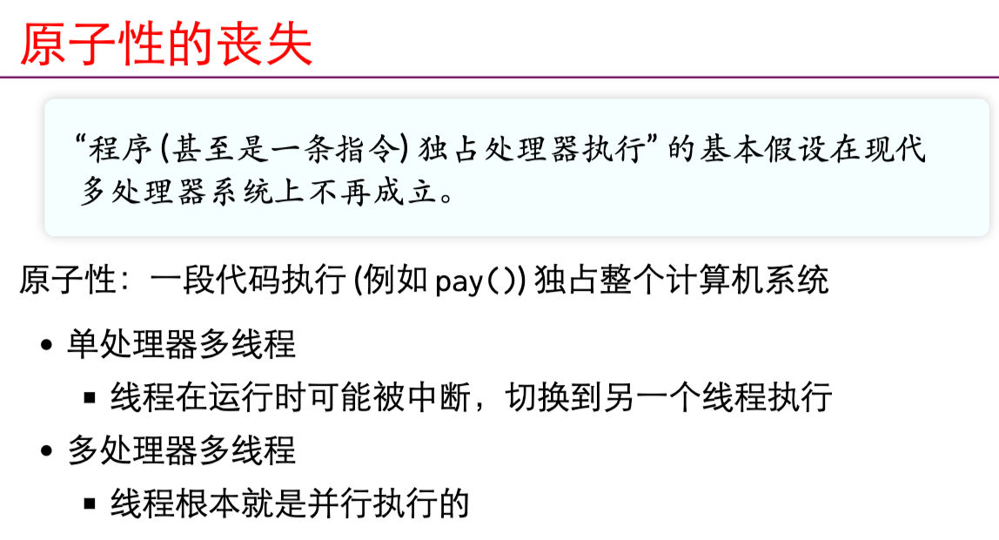

# 参考资料

[blibli南京大学操作系统](https://space.bilibili.com/202224425)

[课程主页](http://jyywiki.cn/OS/2022/)

# 并发

## 多处理器编程

### 入门

[slide](http://jyywiki.cn/OS/2022/slides/3.slides#/2/6)

并发是指宏观上在一段时间内能同时运行多个程序，而并行则指同一时刻能运行多个指令。

并行需要硬件支持，如多流水线、多核处理器或者分布式计算系统。

操作系统通过引入进程和线程，使得程序能够并发运行。

并发的基本单位：**线程**

- 执行流拥有独立的堆栈/寄存器
- 共享全部的内存（指针可以互相引用）

可以将现场比作是教室里的学生，只有一个学生的时候就是单线程的独享所有的资源

但是有多个学生的时候，他们就是共享教室的资源，比如黑板，老师，灯。但是又有自己独享的课桌，课本等。

从状态机的角度来理解什么是并发

 

**单线程**的时候每一步都是确定的，只有一个结果

对于**多线程**时，比如有T1和T2，当执行T1时，此时的资源就只有可以共享的那部分资源和自己独立拥有的，忽视T2线程所独有的。反之执行T2时也是如此。因此，每一步都是不确定的。


```c
#include "thread.h"
void Ta() { while (1) { printf("a"); } }
void Tb() { while (1) { printf("b"); } }
// 创建两个多线程
int main() {
  while (1) { printf("a"); }// 如果加上这行代码就会卡在这一行处。
  create(Ta);
  create(Tb);
}
```

使用`gcc a.c -lpthread`编译代码（编译时需要添加-lpthread）

`./a.out`执行程序我们会发现虽然两个函数都是死循环，但是并不会像我们平常写的代码一样卡在第一个死循环处，而是两个循环都在同时执行，可以看到交替打印的a和b。

思考：我们将一个线程的局部变量存放到全局变量中，我们是否可以通过别的线程访问到这个数据。如何来证明线程确实是共享内存的

```c
// shm-test.c
#include "thread.h"

int x = 0;// 每次调用一个线程x都会增加，因此共享里全局变量

void Thello(int id) {
  // int x = 0; //每次打印的x都为1，并没有共享局部变量
  usleep(id * 100000);
  printf("Hello from thread #%c\n", "123456789ABCDEF"[x++]);
}

int main() {
  for (int i = 0; i < 10; i++) {
    create(Thello);
  }
}
```

### 原子性




lock和unlock之间的区域被称为临界区，绝对的串行化。

### 顺序

编译器对内存访问 “eventually consistent” 的处理导致共享内存作为线程同步工具的失效。

因为编译器回去优化你的代码
### 可见行
处理器也是（动态）编译器


多处理器编程是做不到真正的原子，即使有硬件提供支持，因为**现代处理器也是编译器**会进行编译优化。

## 理解并发程序执行

### Model Checker

什么是一个Modern Checker？

遍历所有模型上的状态

# 互斥

## 共享内存上的互斥

互斥（mutual exclusion），互相排斥

某一个线程持有锁其他线程就必须等待

实现互斥的根本困难：**不能同时读/写共享内存**

## Lock 指令的现代实现

在L1 cache层保持一致性

通过总线将多个CPU的L1 cache连接起来，某一个处理器需要上锁，就需要对其他处理器也执行同样的锁

