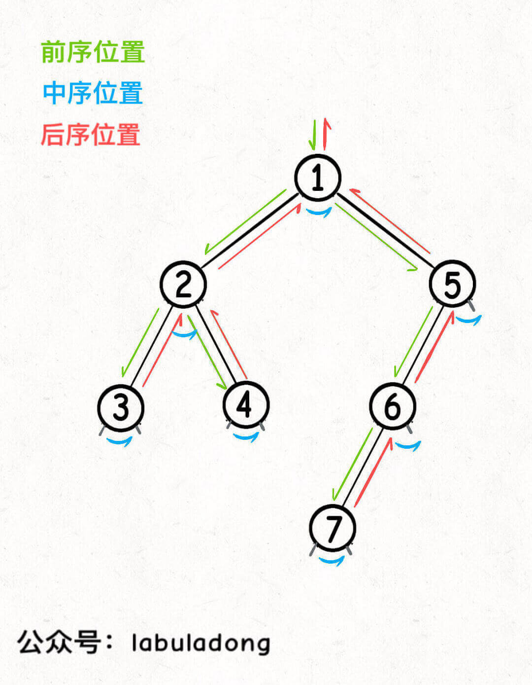

# 参考资料

[labuladong](https://labuladong.github.io/algo/2/20/33/)

# 1. 二叉树的相关定义

对于一般的树加上两个限制条件就得到了二叉树

1. 每个节点最多只有两个子树，即二叉树中节点的度只能为0，1，2
2. 子树有左右顺序之分，不能颠倒

- 满二叉树：所有分支节点都有孩子节点，并且叶子节点都集中在二叉树的下一层。


- 完全二叉树：对一棵深度为k，有n个节点的二叉树进行编号后，各节点编号与深度为k的满二叉树中相同位置上的节点编号均相同。


# 2. 二叉树的顺序存储与链式存储

## 2.1 顺序存储结构
适合完全二叉树和满二叉树

用一组地址连续的存储单元，依次自上而下，自左向右存储完全二叉树的节点元素

## 2.2 链式存储结构
解决顺序存储空间利用率低的问题，**常用**

用一个链表来存储一颗二叉树，二叉树中的每个节点用链表的一个节点来存储

# 3. 二叉树的重要性

先在开头总结一下，二叉树解题的思维模式分两类：

**1、是否可以通过遍历一遍二叉树得到答案**？如果可以，用一个 `traverse` 函数配合外部变量来实现，这叫「遍历」的思维模式。

**2、是否可以定义一个递归函数，通过子问题（子树）的答案推导出原问题的答案**？如果可以，写出这个递归函数的定义，并充分利用这个函数的返回值，这叫「分解问题」的思维模式。

**快速排序就是个二叉树的前序遍历，归并排序就是个二叉树的后序遍历**

**快速排序**的逻辑是，若要对 `nums[lo..hi]` 进行排序，我们先找一个分界点 `p`，通过交换元素使得 `nums[lo..p-1]` 都小于等于 `nums[p]`，且 `nums[p+1..hi]` 都大于 `nums[p]`，然后递归地去 `nums[lo..p-1]` 和 `nums[p+1..hi]` 中寻找新的分界点，最后整个数组就被排序了。

```C++
void sort(int[] nums, int lo, int hi) {
    if (lo >= hi) {
        return;
    }
    // 对 nums[lo..hi] 进行切分
    // 使得 nums[lo..p-1] <= nums[p] < nums[p+1..hi]
    int p = partition(nums, lo, hi);
    // 去左右子数组进行切分
    sort(nums, lo, p - 1);
    sort(nums, p + 1, hi);
}
```

再说说归并排序的逻辑，若要对 `nums[lo..hi]` 进行排序，我们先对 `nums[lo..mid]` 排序，再对 `nums[mid+1..hi]` 排序，最后把这两个有序的子数组合并，整个数组就排好序了。

```C++
// 定义：排序 nums[lo..hi]
void sort(vector<int>& nums, int lo, int hi) {
    int mid = (lo + hi) / 2;
    // 排序 nums[lo..mid]
    sort(nums, lo, mid);
    // 排序 nums[mid+1..hi]
    sort(nums, mid + 1, hi);

    /****** 后序位置 ******/
    // 合并 nums[lo..mid] 和 nums[mid+1..hi]
    merge(nums, lo, mid, hi);
    /*********************/
}
```

先对左右子数组排序，然后合并（类似合并有序链表的逻辑），你看这是不是二叉树的后序遍历框架？另外，这不就是传说中的分治算法嘛，不过如此呀。

# 4. 深入理解二叉树的前中后序遍历

二叉树的遍历模版

```C++
void traverse(TreeNode* root) {
    if (root == nullptr) {
        return;
    }
    // 前序位置
    traverse(root->left);
    // 中序位置
    traverse(root->right);
    // 后序位置
}
```

**所谓前序位置，就是刚进入一个节点（元素）的时候，后序位置就是即将离开一个节点（元素）的时候**，那么进一步，你把代码写在不同位置，代码执行的时机也不同：

**前中后序是遍历二叉树过程中处理每一个节点的三个特殊时间点**，绝不仅仅是三个顺序不同的 List：

前序位置的代码在刚刚进入一个二叉树节点的时候执行；

后序位置的代码在将要离开一个二叉树节点的时候执行；

中序位置的代码在一个二叉树节点左子树都遍历完，即将开始遍历右子树的时候执行。

## 4.1 两种解题思路

**二叉树的所有问题，就是让你在前中后序位置注入巧妙的代码逻辑，去达到自己的目的，你只需要单独思考每一个节点应该做什么，其他的不用你管，抛给二叉树遍历框架，递归会在所有节点上做相同的操作**。

**二叉树题目的递归解法可以分两类思路，第一类是遍历一遍二叉树得出答案，第二类是通过分解问题计算出答案，这两类思路分别对应着 [回溯算法核心框架](https://labuladong.github.io/algo/4/30/104/) 和 [动态规划核心框架](https://labuladong.github.io/algo/3/24/68/)**。

对于leetcode104如何求二叉树的最大深度 [二叉树的最大深度](https://leetcode-cn.com/problems/maximum-depth-of-binary-tree)


就有两种思路

```C++
	// 通过遍历
	// 前序位置
	depth++;
	traverse(root.left);
	traverse(root.right);
	// 后序位置
	depth--;
	// 整个过程中depth的最大值就是这个二叉树的最大深度
```

```C++
// 通过分解子问题
// 利用定义，计算左右子树的最大深度
	int leftMax = maxDepth(root->left);
	int rightMax = maxDepth(root->right);
	// 整棵树的最大深度等于左右子树的最大深度取最大值，
    // 然后再加上根节点自己
	int res = max(leftMax, rightMax) + 1;
```

因为这个思路正确的核心在于，你确实可以通过子树的最大高度推导出原树的高度，所以当然要首先利用递归函数的定义算出左右子树的最大深度，然后推出原树的最大深度，主要逻辑自然放在后序位置。

综上，遇到一道二叉树的题目时的通用思考过程是：

**1、是否可以通过遍历一遍二叉树得到答案**？如果可以，用一个 `traverse` 函数配合外部变量来实现。

**2、是否可以定义一个递归函数，通过子问题（子树）的答案推导出原问题的答案**？如果可以，写出这个递归函数的定义，并充分利用这个函数的返回值。

**3、无论使用哪一种思维模式，你都要明白二叉树的每一个节点需要做什么，需要在什么时候（前中后序）做**。

## 4.2 后序位置的特殊之处

说后序位置之前，先简单说下中序和前序。

中序位置主要用在 BST 场景中，你完全可以把 BST 的中序遍历认为是遍历有序数组。

前序位置本身其实没有什么特别的性质，之所以你发现好像很多题都是在前序位置写代码，实际上是因为我们习惯把那些对前中后序位置不敏感的代码写在前序位置罢了。

你可以发现，前序位置的代码执行是自顶向下的，而后序位置的代码执行是自底向上的：



前序位置是刚刚进入节点的时刻，后序位置是即将离开节点的时刻

**但这里面大有玄妙，意味着前序位置的代码只能从函数参数中获取父节点传递来的数据，而后序位置的代码不仅可以获取参数数据，还可以获取到子树通过函数返回值传递回来的数据**。

**那么换句话说，一旦你发现题目和子树有关，那大概率要给函数设置合理的定义和返回值，在后序位置写代码了**。

## 4.3 层序遍历

层序遍历的主要步骤：

1. 将二叉树根节点入队，然后出队，访问该节点
2. 若它有左子树，则将左子树根节点入队
3. 若它有右子树，则将右子树根节点入队
4. 然后出队，对出队节点访问，如此反复，直到队列为空


二叉树题型主要是用来培养递归思维的，而层序遍历属于迭代遍历，也比较简单，这里就过一下代码框架吧：

```C++


    vector<vector<int>> levelOrder(TreeNode* root) {
        vector<vector<int>> result;
        if(root==nullptr) return result;
      // 使用队列，辅助遍历
        queue<TreeNode*> queue;
        queue.push(root);
        // 从上到下遍历二叉树的每一层
        while(!queue.empty()){
            int qLen = queue.size();
            result.push_back(vector<int>());
            // 从左到右遍历每一层的每个节点
            for(int i=0;i<qLen;i++){
                TreeNode* cur = queue.front();
                queue.pop();
                result[result.size()-1].push_back(cur->val);
                // 将下一层节点放入队列
                if(cur->left) queue.push(cur->left);
                if(cur->right) queue.push(cur->right);
            }
        }
        return result;
    }
```

BFS（广度遍历算法）也是从层序中扩展出来的

# 5. 构造二叉树

一句话概况**二叉树的构造问题一般都是使用「分解问题」的思路：构造整棵树 = 根节点 + 构造左子树 + 构造右子树**。

[参考资料](https://labuladong.github.io/algo/2/20/35/)

[654. 最大二叉树](https://leetcode-cn.com/problems/maximum-binary-tree/)

[105. 从前序与中序遍历序列构造二叉树](https://leetcode-cn.com/problems/construct-binary-tree-from-preorder-and-inorder-traversal/)

[106. 从中序与后序遍历序列构造二叉树](https://leetcode-cn.com/problems/construct-binary-tree-from-inorder-and-postorder-traversal/)

[889. 根据前序和后序遍历构造二叉树](https://leetcode-cn.com/problems/construct-binary-tree-from-preorder-and-postorder-traversal/)

