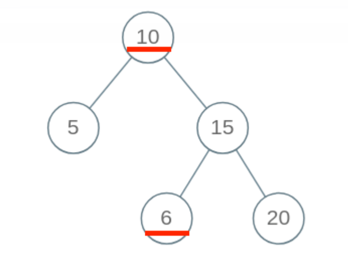

 # 1. 相关定义

Binary Search Tree(二叉搜索树)简称BST

定义：

1. 若左子树非空，则左子树上所有节点关键值均小于根节点的关键值
2. 若右子树非空，则右子树上所有关键值均大于根节点的关键值
3. 左、右子树本身也分别是一颗二叉搜索树

性质：**BST的中序遍历结果是有序的（升序）**

⼆叉搜索树并不算复杂，但我觉得它可以算是数据结构领域的半壁江⼭，直接基于 BST 的数据结构有 AVL 树，红⿊树等等，拥有了⾃平衡性质，可以提供 logN 级别的增删查改效率；还有 B+ 树，线段树等结构都是 基于 BST 的思想来设计的。

# 2. BST的特性

#### [230. 二叉搜索树中第K小的元素](https://leetcode-cn.com/problems/kth-smallest-element-in-a-bst/)

利用了二叉搜索树中序遍历是升序的特点，通过中序遍历到第k个节点返回

#### [538. 把二叉搜索树转换为累加树](https://leetcode-cn.com/problems/convert-bst-to-greater-tree/)


根据题目描述我们需要把遍历的顺序改为 **右根左**

定义一个全局变量来记录累加和sum。

```c++
traverse(node->right);
sum += node->val; // 更新sum
node->val = sum;
traverse(node->left);
return;
```

# 3. BST的相关操作

## 3.1 判断BST的合法性

这⾥是有坑的哦，我们按照刚才的思路，每个节点⾃⼰要做的事不就是⽐较⾃⼰和左右孩⼦吗？看起来应该 这样写代码：

```java
boolean isValidBST(TreeNode root) {
 if (root == null) return true;
 if (root.left != null && root.val <= root.left.val)
 return false;
 if (root.right != null && root.val >= root.right.val)
 return false;
 return isValidBST(root.left) && isValidBST(root.right);
}
```

虽然能满足所有左子节点小于根节点，右子节点大于根节点。但是



**出现问题的原因在于，对于每⼀个节点 root，代码值检查了它的左右孩⼦节点是否符合左⼩右⼤的原则；但 是根据 BST 的定义，root 的整个左⼦树都要⼩于 root.val，整个右⼦树都要⼤于 root.val。**

**我们通过使⽤辅助函数，增加函数参数列表，在参数中携带额外信息，将这种约束传递给⼦树的所有节点， 这也是⼆叉树算法的⼀个⼩技巧吧。**

```java
boolean isValidBST(TreeNode root) {
 return isValidBST(root, null, null);
}
/* 限定以 root 为根的⼦树节点必须满⾜ max.val > root.val > min.val */
boolean isValidBST(TreeNode root, TreeNode min, TreeNode max) {
 // base case
 if (root == null) return true;
 // 若 root.val 不符合 max 和 min 的限制，说明不是合法 BST
 if (min != null && root.val <= min.val) return false;
 if (max != null && root.val >= max.val) return false;
 // 限定左⼦树的最⼤值是 root.val，右⼦树的最⼩值是 root.val
 return isValidBST(root.left, min, root)
 && isValidBST(root.right, root, max);
}
```

## 3.2 在BST中搜索元素

在一颗普通的二叉树中查找元素，我们需要遍历所有的节点来查找元素

```java
TreeNode searchBST(TreeNode root, int target);
 if (root == null) return null;
 if (root.val == target) return root;
 // 当前节点没找到就递归地去左右⼦树寻找
 TreeNode left = searchBST(root.left, target);
 TreeNode right = searchBST(root.right, target);
 return left != null ? left : right;
}
```

但是在BST中，我们可以利用BST的性质，实现类似二分查找的思想，每次舍弃一半的子树

```java
TreeNode searchBST(TreeNode root, int target) {
 if (root == null) {
 return null;
 }
 // 去左⼦树搜索
 if (root.val > target) {
 return searchBST(root.left, target);
 }
 // 去右⼦树搜索
 if (root.val < target) {
 return searchBST(root.right, target);
 }
 return root;
}
```

## 3.3 在BST中插入一个数

对数据结构的操作⽆⾮遍历 + 访问，遍历就是「找」，访问就是「改」。具体到这个问题，插⼊⼀个数，就 是先找到插⼊位置，然后进⾏插⼊操作。 

上⼀个问题，我们总结了 BST 中的遍历框架，就是「找」的问题。直接套框架，加上「改」的操作即可。⼀ 旦涉及「改」，函数就要返回 TreeNode 类型，并且对递归调⽤的返回值进⾏接收。

```java
TreeNode insertIntoBST(TreeNode root, int val) {
 // 找到空位置插⼊新节点
 if (root == null) return new TreeNode(val);
 // if (root.val == val)
 // BST 中⼀般不会插⼊已存在元素
 if (root.val < val)
 root.right = insertIntoBST(root.right, val);
 if (root.val > val)
 root.left = insertIntoBST(root.left, val);
 return root;
}
```

## 3.4 在BST中删除一个数

删除一个数的情况比较复杂，因为要保证在删除后还能具有搜索二叉树的性质

情况 1：A 恰好是末端节点，两个子节点都为空，那么它可以当场去世了。


情况 2：A 只有一个非空子节点，那么它要让这个孩子接替自己的位置。


```
// 排除了情况 1 之后
if (root.left == null) return root.right;
if (root.right == null) return root.left;
```

情况 3：A 有两个子节点，麻烦了，为了不破坏 BST 的性质，A 必须找到左子树中最大的那个节点，或者右子树中最小的那个节点来接替自己。我们以第二种方式讲解。


```java
TreeNode deleteNode(TreeNode root, int key) {
    if (root == null) return null;
    if (root.val == key) {
        // 这两个 if 把情况 1 和 2 都正确处理了
        if (root.left == null) return root.right;
        if (root.right == null) return root.left;
        // 处理情况 3
        TreeNode minNode = getMin(root.right);
        root.val = minNode.val;
        root.right = deleteNode(root.right, minNode.val);
    } else if (root.val > key) {
        root.left = deleteNode(root.left, key);
    } else if (root.val < key) {
        root.right = deleteNode(root.right, key);
    }
    return root;
}

TreeNode getMin(TreeNode node) {
    // BST 最左边的就是最小的
    while (node.left != null) node = node.left;
    return node;
} 
```

# 4. 总结

通过这篇文章，你学会了如下几个技巧：

1. 二叉树算法设计的总路线：把当前节点要做的事做好，其他的交给递归框架，不用当前节点操心。
2. 如果当前节点会对下面的子节点有整体影响，可以通过辅助函数增长参数列表，借助参数传递信息。
3. 在二叉树框架之上，扩展出一套 BST 遍历框架：

```java
void BST(TreeNode root, int target) {
    if (root.val == target)
        // 找到目标，做点什么
    if (root.val < target) 
        BST(root.right, target);
    if (root.val > target)
        BST(root.left, target);
}
```

掌握了 BST 的基本操作。

