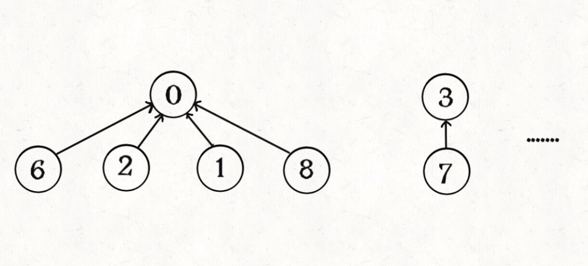

# 图的逻辑结构和实现

图是由节点和边构成


```c++
struct Vertex{
   int id;
   Vertex* neighbors;
}
```

常见的图通常存储在邻接表和邻接矩阵(数组和链表)


最后，我们再明确一个图论中特有的**度**（degree）的概念，在无向图中，「度」就是每个节点相连的边的条数。

由于有向图的边有方向，所以有向图中每个节点「度」被细分为**入度**（indegree）和**出度**（outdegree）

一般会给出一个二维数组记录的信息，将二维数组上的信息构建成图，给出邻接表的实现

```C++
    vector<vector<int> > buildGraph(int numCourses,vector<vector<int> >& prerequisites){
        // 将图存储为邻接表
        vector<vector<int> > graph(numCourses,vector<int>{});
        // 初始化graph
        for(auto edge : prerequisites){
            graph[edge[1]].push_back(edge[0]);
        }
        return graph;
    }
```


# 图的遍历

图的遍历是指从图中的某一个顶点出发，按照某种搜索方法沿着图中的边对图中的所有顶点访问一次且仅访问一次。

图与多叉树的区别在于，图可能是含有环的，因此需要一个visites数组来辅助遍历

主要的算法是BFS和DFS

## DFS

DFS类似数的先序遍历

```java
// 防⽌重复遍历同⼀个节点
boolean[] visited;
// 从节点 s 开始 DFS 遍历，将遍历过的节点标记为 true
void traverse(List<Integer>[] graph, int s) {
 if (visited[s]) {
 return;
 }
 /* 前序遍历代码位置 */
 // 将当前节点标记为已遍历
 visited[s] = true;
 for (int t : graph[s]) {
 traverse(graph, t);
 }
 /* 后序遍历代码位置 */
}
```

## BFS

BFS类似数的层序遍历，多叉树的层序遍历

```C++
queue<Node*> que;
que.push(root);
// 创建一个二维数组存放结果
vector<vector<int>> res;
while(!que.empty()){
// 获取队列元素个数
int queLen = que.size();
// while是每一层的循环
// for是每一层节点的循环
vector<int> hierarchical;
for(int i=0;i<queLen;i++){
// 依次遍历每个子节点，如果子节点有孩子节点就依此入队
  Node* tempNode = que.front();
  que.pop();
  for(Node *child:tempNode->children){
      // 加入队列
      que.push(child);
  }
  hierarchical.push_back(tempNode->val);
}
   res.push_back(hierarchical);
}

```


# 拓扑排序

本⽂就结合具体的算法题，来说两个图论算法：**有向图的环检测、拓扑排序算法**这两个问题既可以用DFS也可以用BFS解决

## 环检测算法DFS


利用回溯算法的思想，记录一个onPath如果路径有重复的，那么说明有环

在进⼊节点 s 的时候将 onPath[s] 标记为 true，离开时标记回 false，如果 发现 onPath[s] 已经被标记，说明出现了环。

```java
    void traverse(vector<vector<int>> &graph,int s){
        if(onPath[s]){
            // 发现环,路径上如果有相同的节点
            hasCycle = true;
        }
        if(visited[s]||hasCycle){
            return;
        }
        // 类似回溯算法的做法
        visited[s] = true; // node是否被访问过
        onPath[s] = true;  // 路径上已有的节点
        for(int node:graph[s]){
            traverse(graph, node);
        }
        onPath[s] = false;
    }
```

## 环检测算法BFS

BFS判断是否有环的思路：

1. 构建邻接表，边的方向表示 被依赖 关系
2. 构建一个indegree数组记录每个节点的入度，即indegree[i]记录节点i的入度
3. 对BFS队列进行初始化，将入度为0的节点首先装入队列
4. 开始执行BFS循环，不断弹出队列中的节点，减少相邻节点的入度，并将入度为0的节点加入队列
5. 如果最终所有节点都被遍历过，则说明不存在环，负责 **存在剩下节点组成的环**

```c++
    bool canFinish(int numCourses, vector<vector<int> >& prerequisites) {
        // 判断是否有循环引用的情况，即可说明是否可以完成
        // 根据数据生成Graph然后判断是否存在环
        
        // 1. 构建图
        vector<vector<int>> graph = buildGraph(numCourses,prerequisites);

        // 2. 构建入度数组
        vector<int> indgree(numCourses,0);
        for(vector<int> edge:prerequisites){
            indgree[edge[0]]++;
        }
        // 3. 判断是否有环(BFS)
        queue<int> que;
        // 初始化，将度为0的节点入队
        for(int i=0;i<numCourses;i++){
            if(indgree[i] == 0){
                // 节点i没有入度，即没有依赖的节点
                // 可以作为拓扑排序的起点，加入队列
                que.push(i);
            }
        }
        int count = 0; // 记录遍历的节点数
        // 标准度BFS模版
        while(!que.empty()){
            // 弹出节点 cur，并将它指向的节点的入度减一
            int cur = que.front();
            que.pop();
            count++;
            for(int node : graph[cur]){
                indgree[node]--;
                if(indgree[node]==0){
                    // 如果入度为0，说明node已经没有依赖
                    que.push(node);
                }
            }
        }
        // 如果所有节点都被遍历过则表示，没有换
        return count==numCourses;
    }
```


## 拓扑排序算法DFS

拓扑排序定义：对一个**有向无环图**G进行拓扑排序，是将G中所有顶点排成一个线性序列，使得图中任意一个顶点u和v，若存在由u到v的路径，则拓扑排序中u出现在v的前面


对于代码实现而言，**拓扑排序首先要判断图不带环，然后就是后序遍历图的结果然后反转，就是拓扑排序的结果**

因此我们只需要在环检测DFS的基础上在后序遍历部分加上对每个节点的记录，然后进行反转就行了。

```c++
    void traverse(vector<vector<int>> &graph,int s){
        if(onPath[s]){
            // 发现环,路径上如果有相同的节点
            hasCycle = true;
        }
        if(visited[s]||hasCycle){
            return;
        }
        // 类似回溯算法的做法
        visited[s] = true;
        onPath[s] = true;
        for(int node:graph[s]){
            traverse(graph, node);
        }
        onPath[s] = false;
        postOrder.push_back(s);
    }
```


## 拓扑排序算法BFS

拓扑排序和环检测BFS的算法基本一致，只需求记录出队的节点顺序，即可得到拓扑排序的节点，前提是图没有环

# 并查集

并查集算法，主要是解决图论中「动态连通性」问题的。

连通是一种等价关系，具有如下三个性质：

1. ⾃反性：节点 p 和 p 是连通的。 
2. 对称性：如果节点 p 和 q 连通，那么 q 和 p 也连通。
3. 传递性：如果节点 p 和 q 连通，q 和 r 连通，那么 p 和 r 也连通。

## 实现并查集

### 初始状态

我们使用森林来表示图的连通性,我们设定数的每个节点有一个指针指向其父节点,如果是根节点的话,这个指针指向自己。

初始状态时，没有互相连通


```c++
class UF{   
private:
    // 记录连通分量
    int count;
    // 节点x的节点是parent[x]
    vector<int> parent;   
public:
    // 构造函数，n为图的节点个数
    UF(int n){
        // 一开始互不连通
        this->count = n;
        // 父节点指针初始指向自己
        parent.resize(n);
        for(int i=0;i<n;i++){
            parent[i] = i;
        }
    }
};
```

如果两个节点连通，则让其中的（任意）一个节点接到另一个节点的根节点上：


```C++
void UF::Union(int p, int q){
    int rootP = find(p);
    int rootQ = find(q);
    if(rootP == rootQ)
        return;
    // 将两棵树合并为1棵
    parent[rootP] = rootQ;
    count--; // 两个连通分量合二为一
}

// 返回某个节点x的根节点
int UF::find(int x){
    // 根节点的parent[x] == x
    while (parent[x]!=x) {
        x = parent[x];
    }
    return x;
}
```

这样的话，如果p和q相连，**它们一定拥有相同的根节点：**


```c++
bool UF::connected(int p, int q){
    return find(p)==find(q);
}
```

到此，一个最基本的并查集就完成了

find 主要功能就是从某个节点向上遍历到树根，其时间复杂度就是树的⾼度。我们可能习惯性地认为树的⾼ 度就是 logN，但这并不⼀定。logN 的⾼度只存在于平衡⼆叉树，对于⼀般的树可能出现极端不平衡的情 况，使得「树」⼏乎退化成「链表」，树的⾼度最坏情况下可能变成 N。

### 平衡性优化

```C++
void UF::Union(int p, int q){
    int rootP = find(p);
    int rootQ = find(q);
    if(rootP == rootQ)
        return;
    // 将两棵树合并为1棵
    parent[rootP] = rootQ;
    count--; // 两个连通分量合二为一
}
```

union只是简单把p所在的树接到了q下面，很容易出现不平衡的现象

利用一个size数组，将节点树较少的树节点节点数大的树，实现平衡优化

```C++
 // ⼩树接到⼤树下⾯，较平衡
 if (size[rootP] > size[rootQ]) {
 	   parent[rootQ] = rootP;
 	   size[rootP] += size[rootQ];
 } else {
 	   parent[rootP] = rootQ;
 	   size[rootQ] += size[rootP];
 }
```

就可以将find的时间复杂度优化到logN级别

### 路径压缩

非常巧妙的优化，将树的高度压缩到常数级别



这样 find 就能以 O(1) 的时间找到某⼀节点的根节点，相应的，connected 和 union 复杂度都下降为 O(1)。

要做到这⼀点，⾮常简单，只需要在 find 中加⼀⾏代码：

```C++
// 返回某个节点x的根节点
int UF::find(int x){
    // 根节点的parent[x] == x
    while (parent[x]!=x) {
        // 进行路径压缩
        parent[x] = parent[parent[x]];
        x = parent[x];
    }
    return x;
}
```

Union-Find 算法的复杂度可以这样分析：构造函数初始化数据结构需要 O(N) 的时间和空间复杂度；连通两 个节点 union、判断两个节点的连通性 connected、计算连通分量 count 所需的时间复杂度均为 O(1)。

### 过程总结

1、⽤ parent 数组记录每个节点的⽗节点，相当于指向⽗节点的指针，所以 parent 数组内实际存储着⼀个 森林（若⼲棵多叉树）。

 2、⽤ size 数组记录着每棵树的重量，⽬的是让 union 后树依然拥有平衡性，保证各个 API 时间复杂度为 O(logN)，⽽不会退化成链表影响操作效率。 

3、在 find 函数中进⾏路径压缩，保证任意树的⾼度保持在常数，使得各个 API 时间复杂度为 O(1)。使⽤了 路径压缩之后，可以不使⽤ size 数组的平衡优化。

## 利用并查集判断图是否有环

**对于添加的这条边，如果该边的两个节点本来就在同⼀连通分量⾥，那么添加这条边会产⽣环；反之，如果 该边的两个节点不在同⼀连通分量⾥，则添加这条边不会产⽣环。**

```java
// 判断输⼊的若⼲条边是否能构造出⼀棵树结构
boolean validTree(int n, int[][] edges) {
 // 初始化 0...n-1 共 n 个节点
 UF uf = new UF(n);
 // 遍历所有边，将组成边的两个节点进⾏连接
 for (int[] edge : edges) {
 int u = edge[0];
 int v = edge[1];
 // 若两个节点已经在同⼀连通分量中，会产⽣环
 if (uf.connected(u, v)) {
 	return false;
 }
 // 这条边不会产⽣环，可以是树的⼀部分
 uf.union(u, v);
 }
 // 要保证最后只形成了⼀棵树，即只有⼀个连通分量
 return uf.count() == 1;
}
```


# 最小生成树

最⼩⽣成树算法主要有 Prim 算法（普⾥姆算法）和 Kruskal 算法（克鲁斯卡尔算法）两种，这两种算法虽然 都运⽤了贪⼼思想，但从实现上来说差异还是蛮⼤的。

**先说「树」和「图」的根本区别：树不会包含环，图可以包含环。**


对于加权图，每条边都有权重，所以每棵⽣成树都有⼀个权重和。⽐如上图，右侧⽣成树的权重和显然⽐左 侧⽣成树的权重和要⼩。

**那么最⼩⽣成树很好理解了，所有可能的⽣成树中，权重和最⼩的那棵⽣成树就叫「最⼩⽣成树」。**

最小生成树不唯一，但是最小生成树的权值和是唯一的

## Kruskal算法

算法思想：将图中边按从小到大排序，然后从最小边开始扫描各边，并检测当前边是否为候选边，即是否该边大并入会构成回路，如不构成回路，则将该边并入当前生成树中，直到所有边都被检测完为止

保证：

1. 包含图中的所有节点
2. 形成的结构是树结构（不存在环）
3. 权重和最小

## Prim算法

算法思想：从图中任取一个顶点，把它当成一棵树，然后从与这棵树相接的边中选取一条**最短**的边，并将这条边及其所连顶点并入当前树中，以此类推，直到所有顶点都并入树中。

Prim 算法也使⽤贪⼼思想来让⽣成树的权重尽可能⼩，Prim 算法使⽤ BFS 算法思想 和 visited 布尔数组避免成环，来保证选出来的边最终形成的⼀定是⼀ 棵树。

Prim 算法不需要事先对所有边排序，⽽是利⽤优先级队列动态实现排序的效果，所以我觉得 Prim 算法类似 于 Kruskal 的动态过程。

# 最短路径

[参考视频](https://www.youtube.com/watch?v=yYR-XDU7C0Q&list=PLl-9hEcChubjZRzIoSdACioC2Fsx-JBup&index=62)

如果是无权图的最短路径问题，我们就可以直接使用BFS算法求解，但是对于有权图来说并不适用


## 例题

### [1631. 最小体力消耗路径](https://leetcode-cn.com/problems/path-with-minimum-effort/)

根据题意要求起点到总点的最小体力值，也就是整个最小路径上权重最大的边

利用最短路径迪杰斯特拉肯定能求解，返回最短路径上的最大值

也可以利用并查集+kriskal的思想，当起点和终点连通，那么最后加入的那条边就是整个路径上权重最大的

```C++
int minimumEffortPath(vector<vector<int>>& heights) {
        // Edge. <int p1,int p2, int weight>
        // 1. build graph
        int m=heights.size(),n=heights[0].size();
        vector<vector<int>> dir{{-1,0},{1,0},{0,-1},{0,1}};
        vector<Edge> edges;
        for(int i=0;i<m;i++){
            for(int j=0;j<n;j++){
                // 每个顶点要向4个方向构建边
                for(int ii=0;ii<4;ii++){
                    int x = i+dir[ii][0];
                    int y = j+dir[ii][1];
                    if(x>=0&&y>=0&&x<m&&y<n){
                        // 节点是合法的
                        edges.push_back({i*n+j,x*n+y,abs(heights[i][j]-heights[x][y])});
                    }
                }
            }
        }
        int num = m*n;  // n为图中的节点
        int mst = 0; //最小权值和
        // 根据Kruskal的算法思想，对所有边排序选最短的,从小到大排序好
        sort(edges.begin(), edges.end(), [](Edge a, Edge b) -> int { return a.weight < b.weight; });
        UnionFind uf(num);
        for(auto &edge:edges){
            int u = edge.p1;
            int v = edge.p2;
            int weight = edge.weight;
            uf.Union(u,v);
            // 若起点和终点是连通的
            if(uf.connected(0,m*n-1)){
                return weight;
            }
        }
        return 0;
    }
```
也可以利用迪杰斯特拉迪思想，计算起点到终点的最小路径 
只不过要根据题意修改，不计算整个路径和，而是计算整个路径上的最大体力值

```c++
int distToNextNode = max(distTo[curNodeID], abs(heights[curNodeID/n][curNodeID%n]-heights[nextNodeID/n][nextNodeID%n]));
if(curNodeID==m*n-1){
   return curDistFromStart;
}
```

# 二分图判定

## 二分图简介

`二分图的顶点集可分割为两个互不相交的子集，图中每条边依附的两个顶点都分属于这两个子集，且两个子集内的顶点不相邻。`


这就是图的「双色问题」，其实这个问题就等同于二分图的判定问题，如果你能够成功地将图染色，那么这幅图就是一幅二分图，反之则不是：


## 二分图的判定思路

判定二分图的算法很简单，就是用代码解决「双色问题」。

**说白了就是遍历一遍图，一边遍历一边染色，看看能不能用两种颜色给所有节点染色，且相邻节点的颜色都不相同**。

```C++
/* 二叉树遍历框架 */
void traverse(TreeNode root) {
    if (root == null) return;
    traverse(root.left);
    traverse(root.right);
}

/* 多叉树遍历框架 */
void traverse(Node root) {
    if (root == null) return;
    for (Node child : root.children)
        traverse(child);
}

/* 图遍历框架 */
boolean[] visited;
void traverse(Graph graph, int v) {
    // 防止走回头路进入死循环
    if (visited[v]) return;
    // 前序遍历位置，标记节点 v 已访问
    visited[v] = true;
    for (TreeNode neighbor : graph.neighbors(v))
        traverse(graph, neighbor);
}
```

### 深度优先/广度优先搜索

我们使用图搜索算法从各个连通域的任一顶点开始遍历整个连通域，遍历的过程中用两种不同的颜色对顶点进行染色，相邻顶点染成相反的颜色。这个过程中倘若发现相邻的顶点被染成了相同的颜色，说明它不是二分图；反之，如果所有的连通域都染色成功，说明它是二分图。

### 并查集

我们知道如果是二分图的话，那么图中每个顶点的所有邻接点都应该属于同一集合，且不与顶点处于同一集合。因此我们可以使用并查集来解决这个问题，我们遍历图中每个顶点，将当前顶点的所有邻接点进行合并，并判断这些邻接点中是否存在某一邻接点已经和当前顶点处于同一个集合中了，若是，则说明不是二分图。

