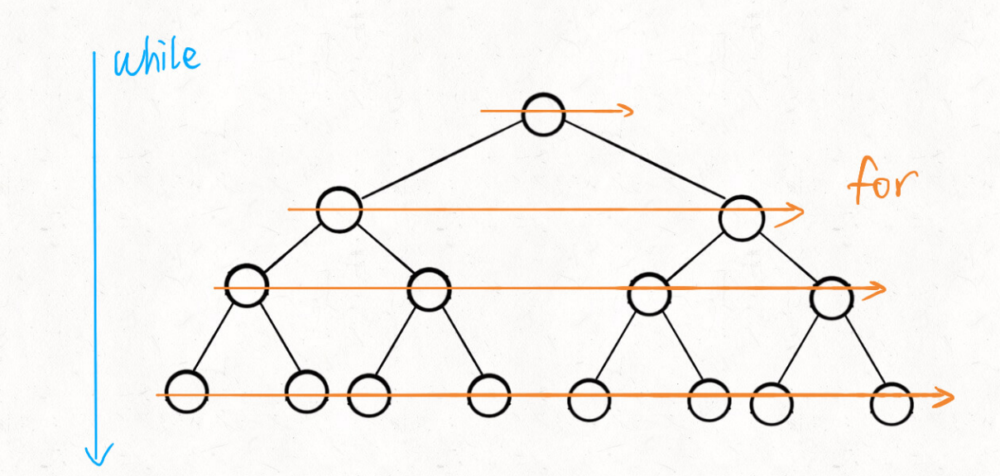

# 广度优先搜索概述BFS

BFS 的核⼼思想应该不难理解的，就是把⼀些问题抽象成图，从⼀个点开始，向四周开始扩散。⼀般来说， 我们写 BFS 算法都是⽤「队列」这种数据结构，每次将⼀个节点周围的所有节点加⼊队列。

过程：

1. 任取图中一个顶点访问，入队并将这个顶点标记为已访问
2. 当队列不为空时循环执行：出队，依次检查所有出队点的所有邻接顶点，访问没有访问过的邻接顶点并将其入队
3. 当队列不为空时跳出循环，广度优先搜索完成。

BFS 相对 DFS 的最主要的区别是：**BFS 找到的路径⼀定是最短的，但代价就是空间复杂度可能⽐ DFS ⼤很多**

# 算法框架

```java
// 计算从起点 start 到终点 target 的最近距离
int BFS(Node start, Node target) {
 Queue<Node> q; // 核⼼数据结构
 Set<Node> visited; // 避免⾛回头路

 q.offer(start); // 将起点加⼊队列
 visited.add(start);
 int step = 0; // 记录扩散的步数
 while (q not empty) {
 int sz = q.size();
 /* 将当前队列中的所有节点向四周扩散 */
 for (int i = 0; i < sz; i++) {
    Node cur = q.poll();
    /* 划重点：这⾥判断是否到达终点 */
    if (cur is target)
       return step;
    /* 将 cur 的相邻节点加⼊队列 */
    for (Node x : cur.adj()) {
 	      if (x not in visited) {
        q.offer(x);
        visited.add(x);
        }
     }
 }
 /* 划重点：更新步数在这⾥ */
 step++;
 }
}
```



还是拿刚才我们处理⼆叉树问题的例⼦，假设给你的这个⼆叉树是满⼆叉树，节点数为 N，对于 DFS 算法来 说，空间复杂度⽆⾮就是递归堆栈，最坏情况下顶多就是树的⾼度，也就是 O(logN)。

 但是你想想 BFS 算法，队列中每次都会储存着⼆叉树⼀层的节点，这样的话最坏情况下空间复杂度应该是树 的最底层节点的数量，也就是 N/2，⽤ Big O 表示的话也就是 O(N)。