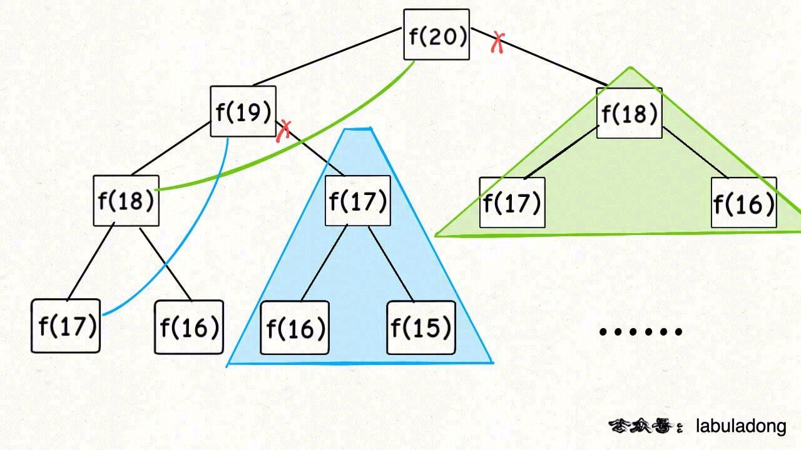
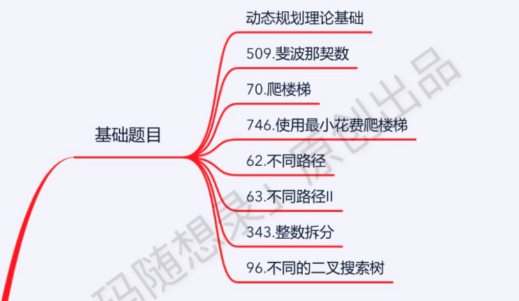

# 1. 动态规划基本技巧

## 1.1 解题套路

**首先，动态规划问题的一般形式就是求最值**。动态规划其实是运筹学的一种最优化方法，只不过在计算机问题上应用比较多，比如说让你求**最长**递增子序列呀，**最小**编辑距离呀等等

**求解动态规划的核心问题是穷举**。

动态规划的穷举有点特别，因为这类问题**存在「重叠子问题」**，如果暴力穷举的话效率会极其低下，所以需要「备忘录」或者「DP table」来优化穷举过程，避免不必要的计算。

而且，动态规划问题一定会**具备「最优子结构」**，才能通过子问题的最值得到原问题的最值。

虽然动态规划的核心思想就是穷举求最值，但是问题可以千变万化，穷举所有可行解其实并不是一件容易的事，只有列出**正确的「状态转移方程」**，才能正确地穷举。

**明确 base case -> 明确「状态」-> 明确「选择」 -> 定义 dp 数组/函数的含义**

## 1.2 代码框架

动态规划算法题一般有两种解法，自顶向下和自底向上

### 自顶向下（递归+备忘录）

其实就是执行递归算法解决问题，在递归的过程中有很多重复计算的过程，利用一个数组一般的一维和二维记录特定状态下的结果，避免重复计算

比如在求斐波拉契数时，等解决问题后，还可以根据情况考虑优化数组，能到达O(1)的空间复杂度

比如求斐波拉契其实只用到了和要求数的前两个数即可，因此备忘录就只用记录前两个

### 迭代求dp数组

有了上一步「备忘录」的启发，我们可以把这个「备忘录」独立出来成为一张表，通常叫做 DP table，在这张表上完成「自底向上」的推算岂不美哉！

明确步骤：

1. 确定递推公式
2. dp数组如何初始化
3. 确定遍历顺序
4. 举例推导dp数组

# 基础题目

