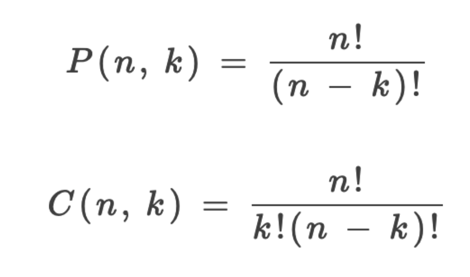
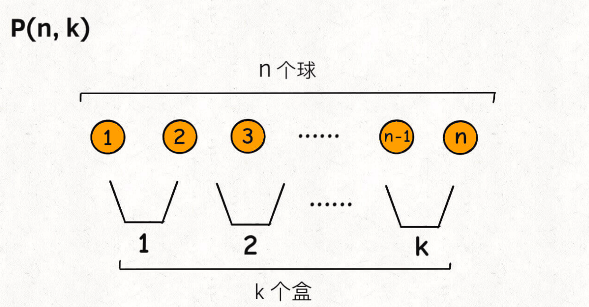
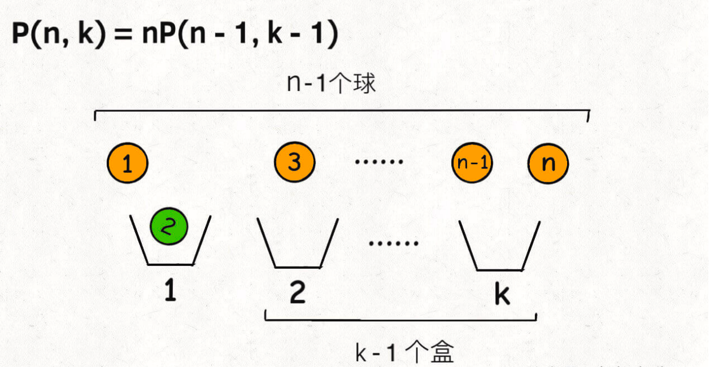
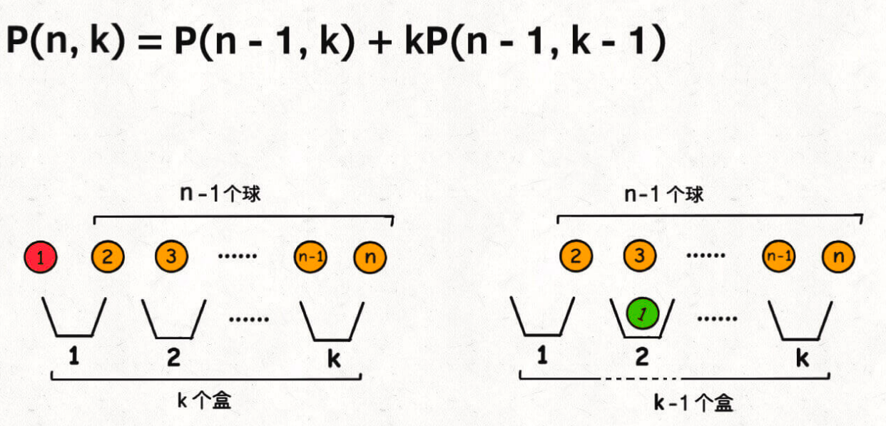

# 回溯算法核心框架

1. 回溯算法就是一种暴力穷举算法
2. 穷举的过程就是遍历一颗多叉树的过程
3. 回溯算法的代码框架和多叉树遍历的代码框架类似

一条路走到底，无路可走返回上一层继续找，和DFS过程类似


**前序遍历的代码在进入某一个节点之前的那个时间点执行，后序遍历代码在离开某个节点之后的那个时间点执行**。

```C++
void traverse(TreeNode root) {
    for (TreeNode child : root.childern) {
        // 前序遍历需要的操作
        traverse(child);
        // 后序遍历需要的操作
    }
}
```

但是必须说明的是，不管怎么优化，都符合回溯框架，而且时间复杂度都不可能低于 O(N!)，因为穷举整棵决策树是无法避免的。**这也是回溯算法的一个特点，不像动态规划存在重叠子问题可以优化，回溯算法就是纯暴力穷举，复杂度一般都很高**。

# 回溯算法与深度优先遍历

[参考资料](https://leetcode-cn.com/problems/permutations/solution/hui-su-suan-fa-python-dai-ma-java-dai-ma-by-liweiw/)

以下是维基百科中「回溯算法」和「深度优先遍历」的定义。

回溯法 采用试错的思想，它尝试分步的去解决一个问题。在分步解决问题的过程中，当它通过尝试发现现有的分步答案不能得到有效的正确的解答的时候，它将取消上一步甚至是上几步的计算，再通过其它的可能的分步解答再次尝试寻找问题的答案。回溯法通常用最简单的递归方法来实现，在反复重复上述的步骤后可能出现两种情况：

找到一个可能存在的正确的答案；
在尝试了所有可能的分步方法后宣告该问题没有答案。
深度优先搜索 算法（英语：Depth-First-Search，DFS）是一种用于遍历或搜索树或图的算法。这个算法会 尽可能深 的搜索树的分支。当结点 v 的所在边都己被探寻过，搜索将 回溯 到发现结点 v 的那条边的起始结点。这一过程一直进行到已发现从源结点可达的所有结点为止。如果还存在未被发现的结点，则选择其中一个作为源结点并重复以上过程，整个进程反复进行直到所有结点都被访问为止。

# 排列组合

## 思路分析

回顾排列组合的知识：

1. P(n, k)（也有很多书写成 A(n, k)）表示从 n 个不同元素中拿出 k 个元素的排列 （Permutation/Arrangement）；C(n, k) 表示从 n 个不同元素中拿出 k 个元素的组合（Combination）总 数。
2. 「排列」和「组合」的主要区别在于是否考虑顺序的差异。
3. 排列、组合总数的计算公式：



可以利用球盒模型来抽象P(n,k)



即：将n个标记了不同序号的球，放入k个标记了不同序号的盒子中，共有P(n,k)种方法

可以通过两个不同的角度来求解这个问题

## 角度一

**从盒子的视角考虑**，每个盒子必然要选择一个球

这样，第⼀个盒⼦可以选择 n 个球中的任意⼀个，然后你需要让剩下 k - 1 个盒⼦在 n - 1 个球中选择：



因此根据递归公式结合前面的回溯框架，能得出

```C++
class Solution {
public:
    bool canPartitionKSubsets(vector<int>& nums, int k) {
        // 排除一些情况
        if(k>nums.size()) return false;
        int sum = 0;
        for(int v:nums){
            sum+=v;
        }
        if(sum%k!=0) return false;

        // k个桶（集合），记录每个桶的数字之和
        vector<int> bucket(k); //记录每个桶的数字和
        int target = sum/k;
        // 穷举，看sums是否能被划分成为k个和为target的子集
        return backtrack(nums,0,bucket,target);
    }
    bool backtrack(vector<int> &nums,int index, vector<int> &bucket,int target){
        if(index == nums.size()){
            // 所有的数字都放完了，检查是否每个桶的数字之和都是target
            for(int i=0;i<bucket.size();i++){
                if(bucket[i] != target){
                    return false;
                }
            }
            return true;
        }
        // 穷举每个nums[index]可能装入的桶
        for(int i=0;i<bucket.size();i++){
            if(bucket[i]+nums[index]>target){
                // 装满了，剪值
                continue;
            }
            // 将nums[index]装入bucket[i]
            bucket[i]+=nums[index];
            // 穷举下一个数字的选择
            if(backtrack(nums,index+1,bucket,target)){
                return true;
            }
            // 撤销选择
            bucket[i] -= nums[index];
        }
        // nums[index] 装入哪个桶都不行
        return false;
    }
};
```

但是最后有测试用例超时的情况发生，因此还需要进行优化

换一种角度来看

## 角度二

**从球的视角考虑**，并不是每个球都会被装进盒子里，所有分两种情况：

1. 第一个球可以不装进任何盒子，剩下的n-1个球放入k个盒子
2. 第一个球可以装进k个盒子中的任意一个，这样的话你就需要将剩下n-1个球放入k-1个盒子



**以桶的视⻆进⾏穷举，每个桶需要遍历 nums 中的所有数字，决定是否把当前数字装进桶 中；当装满⼀个桶之后，还要装下⼀个桶，直到所有桶都装满为⽌。**

```java
// 装满所有桶为⽌
while (k > 0) {
 // 记录当前桶中的数字之和
 int bucket = 0;
 for (int i = 0; i < nums.length; i++) {
 // 决定是否将 nums[i] 放⼊当前桶中
 bucket += nums[i] or 0;
 if (bucket == target) {
 // 装满了⼀个桶，装下⼀个桶
 k--;
 break;
 }
 }
}
```

将这段代码的while循环改成递归函数

实现 backtrack 函数的逻辑之前，再重复⼀遍，从桶的视⻆：  

1、需要遍历 nums 中所有数字，决定哪些数字需要装到当前桶中。 

2、如果当前桶装满了（桶内数字和达到 target），则让下⼀个桶开始执⾏第 1 步。

```c++
    bool canPartitionKSubsets(vector<int>& nums, int k) {
        // 排除一些情况
        if(k>nums.size()) return false;
        int sum = 0;
        for(int v:nums){
            sum+=v;
        }
        if(sum%k!=0) return false;

        // k个桶（集合），记录每个桶的数字之和
        vector<int> bucket(k,0); //记录每个桶的数字和
        int target = sum/k;
        vector<bool> visited(nums.size(),false);
        // 穷举，看sums是否能被划分成为k个和为target的子集
        

        return backtrack(k,0,nums,0,visited,target);
    }
    //现在 k 号桶正在思考是否应该把 nums[start] 这个元素装进来；⽬前 k 号桶⾥⾯已经装的数字之和为bucket；used 标志某⼀个元素是否已经被装到桶中；target 是每个桶需要达成的⽬标和。
    bool backtrack(int k,int bucket,vector<int> &nums,int start, vector<bool> &visited,int target){
        if(k==0){
            // 所有桶都满了，而且nums也一定全部用完了
            return true;
        }
        if(bucket==target){
            // 装满了当前桶，递归穷举下一个桶的选择
            return backtrack(k-1,0,nums,0,visited,target);
        }
        // 穷举每个nums[index]可能装入的桶
        for(int i=start;i<nums.size();i++){
            if(visited[i]){
                // 已经装在别的集合里了
                continue;
            }
            if(bucket+nums[i]>target){
                // 装满了，剪枝
                continue;
            }
            // 将nums[index]装入bucket[i]
            visited[i] = true;
            bucket+=nums[i];
            // 穷举下一个数字的选择
            if(backtrack(k,bucket,nums,i+1,visited,target)){
                return true;
            }
            // 撤销选择
            bucket -= nums[i];
            visited[i] = false;
        }
        // nums[index] 装入哪个桶都不行
        return false;
    }
```

