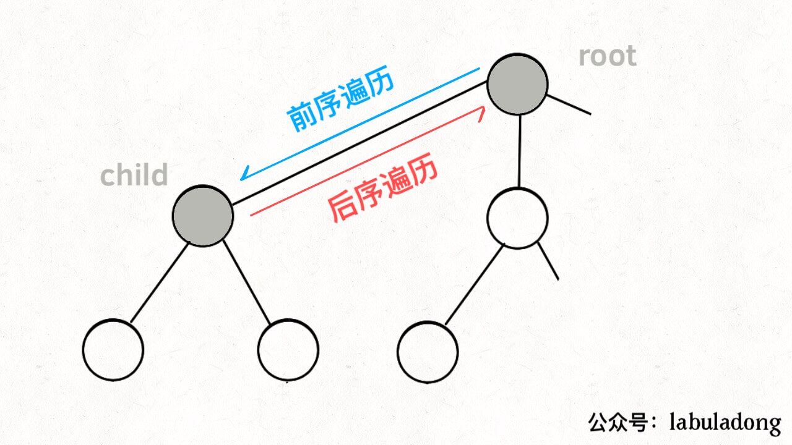

# 回溯算法核心框架

1. 回溯算法就是一种暴力穷举算法
2. 穷举的过程就是遍历一颗多叉树的过程
3. 回溯算法的代码框架和多叉树遍历的代码框架类似

一条路走到底，无路可走返回上一层继续找，和DFS过程类似



**前序遍历的代码在进入某一个节点之前的那个时间点执行，后序遍历代码在离开某个节点之后的那个时间点执行**。

```C++
void traverse(TreeNode root) {
    for (TreeNode child : root.childern) {
        // 前序遍历需要的操作
        traverse(child);
        // 后序遍历需要的操作
    }
}
```

但是必须说明的是，不管怎么优化，都符合回溯框架，而且时间复杂度都不可能低于 O(N!)，因为穷举整棵决策树是无法避免的。**这也是回溯算法的一个特点，不像动态规划存在重叠子问题可以优化，回溯算法就是纯暴力穷举，复杂度一般都很高**。

# 回溯算法与深度优先遍历

[参考资料](https://leetcode-cn.com/problems/permutations/solution/hui-su-suan-fa-python-dai-ma-java-dai-ma-by-liweiw/)

以下是维基百科中「回溯算法」和「深度优先遍历」的定义。

回溯法 采用试错的思想，它尝试分步的去解决一个问题。在分步解决问题的过程中，当它通过尝试发现现有的分步答案不能得到有效的正确的解答的时候，它将取消上一步甚至是上几步的计算，再通过其它的可能的分步解答再次尝试寻找问题的答案。回溯法通常用最简单的递归方法来实现，在反复重复上述的步骤后可能出现两种情况：

找到一个可能存在的正确的答案；
在尝试了所有可能的分步方法后宣告该问题没有答案。
深度优先搜索 算法（英语：Depth-First-Search，DFS）是一种用于遍历或搜索树或图的算法。这个算法会 尽可能深 的搜索树的分支。当结点 v 的所在边都己被探寻过，搜索将 回溯 到发现结点 v 的那条边的起始结点。这一过程一直进行到已发现从源结点可达的所有结点为止。如果还存在未被发现的结点，则选择其中一个作为源结点并重复以上过程，整个进程反复进行直到所有结点都被访问为止。

