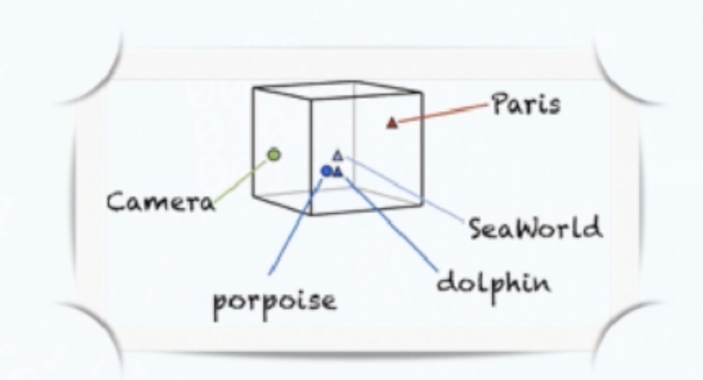

# 1. 知识图谱概述

## 1.1 语言与知识

1. 人的大脑依靠所学的知识进行思考和推理，具有表示、获取、学习和处理知识的能力是人类心智区别于其他物种最根本的区别之一。
2. 语言是知识的最主要表示载体，语言与知识是实现认知智能最重要的两个方面。
3. 知识图谱可以看作是一种结构化的知识表示方法，相比于文本更易于被机器查询和处理，因而在搜索引擎、智能问答、大数据分析等领域被广泛应用。
4. 语言与知识的向量化表示，以及利用神经网络实现语言与知识的处理是重要的人工智能技术发展趋势。

## 1.2 知识图谱的演变

## 1.3 知识图谱的价值

1. 知识图谱技术源于互联网，最早落地应用的也是**搜索引擎、智能问答和推荐计算**等技术领域。
2. 知识图谱通过规范化语义融合**多来源数据**，并能通过**图谱推理**能力支持复杂关联数据的挖掘分析，因此在**大数据分析**领域也有广泛应用。
3. 不论是语言理解和视觉理解，外源知识库的引入都可以有力的提升语义理解的深度和广度。
4. 知识图谱在**医疗、金融、电商、通信**等多个垂直领域都有着广泛的应用，并且每个领域都有其独特的实现和实践方式。

## 1.4 知识图谱的技术内涵

知识图谱不是单一技术，做知识图谱需要建立系统工程思维

# 2. 知识图谱表示

## 2.1 什么是知识表示

- 简单而言，知识表示(KR)就是易于计算机处理的方式来描述人脑的方法
- KR不是数据格式、不等同于数据结构、也不是编程语言，对于人工智能而言，数据与知识的区别在于KR支持推理

**KR的五个用途**

1. A KR is a Surrogate—— 客观事物的机器**标识**——Entity ID
2. A KR is a Set of Ontological Commitments——一组本体约定和概念模型——模型概念
3. A KR is a Theory Of Intelligent Reasoning——支持推理的表示基础——推理
4. A KR is a Medium for Efficient Compution——用于高效计算的数据结构——易于计算
5. A KR is a Medium of Human Expression——人可理解的机器语言——人可理解

### 2.1.1 基于离散符号的知识表示

RDF，OWL，各种Rule Language等，利用符号来表示知识。

显示知识、强逻辑约束、易于解释、推理不易扩展

### 2.1.2 基于连续向量的知识表示

随着深度学习和表示学习的兴起，用参数化的向量来表示实体以及实体之间的关系，并利用神经网络来实现更鲁棒的推理，成为一个重要的发展趋势。

Tenseor，各种Embedding，神经网络表示等。

隐式知识、弱逻辑约束、不易解释、易于对接神经网络

## 2.2 AI历史长河中的知识表示方法

- 知识表示与推理在人工智能的发展历史上一直居于核心位置
- 传统的知识表示方法主要以符号为主，与知识图谱有关的典型方法有：描述逻辑、Horn Logic、产生式规则、框架系统、语义网络等等。
- 这些方法各有优缺点，但都有一个共同的缺点是知识的获取过程主要依靠专家和人工，越复杂的知识表示框架知识获取过程越困难

## 2.3 知识图谱的符号表示方法

在知识图谱的实际实践中，不同的应用场景会知识的建模采用不同表达能力的图表示方法

### 2.3.1 Property Graph——属性图

- 在属性图的术语中，属性图是由 顶点（Vertex）， 边（Edge），标签（Label），关系类型还有属性 （Property）组成的有向图。 
- 顶点也称为 节点（Node），边也称为 关系 （Relationship）。 
- 在属性图中，节点和关系是最重要的实体。节点上 包含属性，属性可以以任何键值形式存在。
- 关系连接节点，每个关系都有拥有一个方向、 一个标签、一个开始节点和结束节点。关系的 方向的标签使得属性图具有语义化特征。
- 和节点一样，关系也可以有属性，即边属性， 可以通过在关系上增加属性给图算法提供有关 边的元信息，如创建时间等，此外还可以通过 边属性为边增加权重和特性等其他额外语义。

由一个个的三元组表示

### 2.3.2 RDF——资源描述框架

RDF是国际万维网联盟W3C推动的面向Web的语义数据标准

### 2.3.3 RDFS

Defines small vocabulary for RDF: Class, subClassOf, type, Property, subPropertyOf, Domain, Range

### 2.3.4 OWL Web Ontologies

### 2.3.5 总结

1. 属性图是工业界最常见的图谱建模方法，属性图数据库充分利用图结 构特点做了性能优化，实用度高，但不支持符号推理。 
2. RDF是W3C推动的语义数据交换标准与规范，有更严格的语义逻辑基础， 支持推理，并兼容更复杂的本体表示语言OWL。 
3. 在三元组无法满足语义表示需要时，OWL作为一种完备的本体语言， 提供了更多可供选用的语义表达构件。 
4. 描述逻辑可以为知识图谱的表示与建模提供理论基础。描述逻辑之于 知识图谱，好比关系代数之于关系数据库。

## 2.4 知识图谱的向量表示方法

- 知识表示是传统符号人工智能研究的核心，知识表示的方法在早期语义网的 发展过程主要用来为知识图谱的概念建模提供理论基础； 
- 现实的知识图谱项目由于规模化构建的需要，常常降低表示的逻辑严格性， 目前较为常见的知识图谱实践包括RDF图模型和属性图模型； 
- 尽管很多知识图谱并没有应用复杂的知识表示框架，Schema工程对于知识图 谱的构建仍然是基础性和必要性的工作，高质量的知识图谱构建通常从 Schema设计开始。
- 在知识图谱的深度利用中，如复杂语义的表达、规则引擎的构建、推理的实现，会对 更有丰富表达能力的知识表示方法有更多的需求。 
- 图模型是更加接近于人脑认知和自然语言的数据模型，RDF作为一种知识图谱表示框 架的参考标准，向上对接OWL等更丰富的语义表示和推理能力，向下对接简化后的属 性图数据库以及图计算引擎，仍然是最值得重视的知识图谱表示框架。 
- 知识（图谱）的表示学习是符号表示与神经网络相结合比较自然且有前景的方向。知 识的向量表示有利于刻画那些隐含不明确的知识，同时基于神经网络和表示学习实现 的推理一定程度上可以解决传统符号推理所面临的鲁棒性不高不容易扩展等众多问题。

