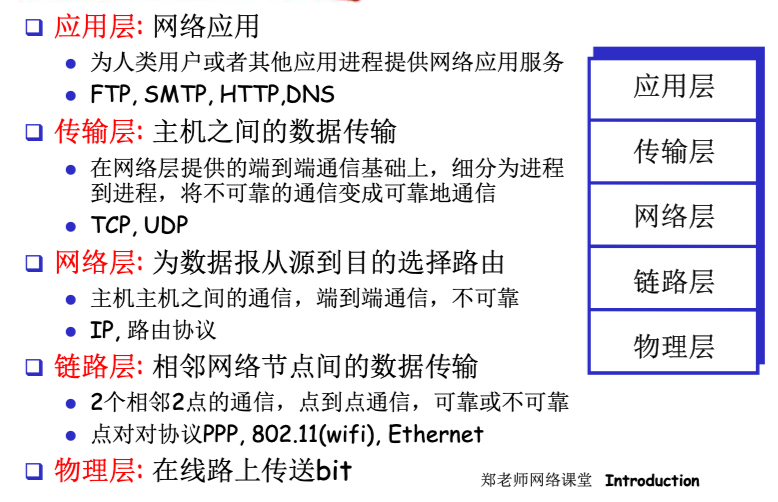

# 参考资料

[中科大网课](https://www.bilibili.com/video/BV1JV411t7ow)

[CSDN参考笔记](https://blog.csdn.net/qq_53111905/article/details/119002010)

[CSDN参考笔记](https://blog.csdn.net/weixin_53051813/article/details/123204109)

参考书籍是：计算机网络自顶向下

# 第一章 计算机网络和互联网

## 1.1 什么是Internet？

可以分别从具体构成角度和服务角度来看

### 具体构成角度

- 节点
  - 主机及其上运行的应用程序
  - 路由器、交换机等网络交换设备
- 边
  - 接入网链路：主机连接到互联网的链路
  - 主干链路：路由器间的链路
- **协议**
  - <u>协议定义了在两个或多个通信实体之间交换的**报文格式**和**次序**，以及在报文传输和/或接收或其他事件方面所采取的**动作**。</u>
  - 简单来说就是 **语法 语义 时序**
  - 协议控制发送接收消息(TCP,IP,HTTP,FTP,PPP)
- 数以亿计的计算设备
  - 主机 = 端系统
  - 运行网络应用程序
- 通信链路
  - 光纤、同轴电缆、无线电 、卫星
  - 传输速率 = 带宽（bps）
- 分组交换设备
  - 路由器和交换机（具体会在网络层谈到）

### 服务角度

- 使用通信设施进行通信的分布式应用，如Web、VoIP、email、分布式游戏、电子商务、社交网络
- 通信基础设施为apps提供编程接口(通信服务）
  - 将发送和接收数据的apps与互联网连接起来
  - 为app应用提供服务选择，类似于邮政服务:
    - 无连接不可靠服务
    - 面向连接的可靠服务

## 1.2 网络边缘

在网络的边缘，端系统（主机），C/S,p2p...

每个节点既是服务器也是客户端，互相请求，分布式系统，无客户/服务器模式的缺陷
迅雷、电驴等 可以获得带宽的聚集

### 采用网络设施的面向连接服务

- 目标:在端系统之间传输数据
  - 握手:在数据传输之前做好准备
    - 人类协议中:你好、你好
    - 两个通信主机之间为连接建立状态
- TCP–传输控制协议(Transmission Control Protocol) Internet上面向连接的服务
  - 可靠地、按顺序地传送数据。确认和重传
  - 流量控制。发送方不会淹没接收方
  - 拥塞控制。当网络拥塞时，发送方降低发送速率
- 使用TCP的应用：HTTP (Web), FTP (文件传 送), Telnet (远程登录), SMTP (email)

### 采用基础设施的无连接服务

- **目标**：在端系统之间传输数据，无连接服务
- UDP – 用户数据报协议 (User Datagram Protocol)
  - 无连接
  - 不可靠传输
  - 无流量控制
  - 无拥塞控制
- 使用UDP的应用：流媒体（直播，视频）、远程会议、DNS。。。

## 1.3 网络核心

网络核心：路由器的网状结构

基本问题：数据怎样通过网络进行传输？

电路交换：为每个呼叫预留一条专有电路，如电话网

分组交换：1）将要传送的数据分成一个个单位：分组

​					2）将分组从一个路由器传到相邻路由器（hop），一段段最终从源端传到目标端

​                    3）每段：采用链路的最大传输能力

### 电路交换

不适合计算机之间的通信

### 分组交换

排队和延迟：

- 如果到达速率>链路的输出速率：
  - 分组将会排队，等待传输
  - 如果路由器的缓存用完了，分组将会被抛弃

**路由**：决定分组采用的源到目标的路径

**转发**：将分组从路由器的输入链路转移到输出链路

### 分组交换vs电路交换

- 同样的网络资源，分组交换允许更多用户使用网络。电路交换建立连接后是独占资源
- 分组交换更适用于**突发**数据传输。不需要提前建立连接
- 分组交换过度使用会造成**网络拥堵**。分组延迟和丢失

## 1.4 接入网和物理媒体

## 1.5 Internet结构和ISP

数亿计的网络是如何连接到一起的？

互联网的结构是：**网络的网络**

端系统通过ISPs（互联网提供商）连接到互联网

存在多个不同的ISP，它们之间存在着竞争与合作的关系，通过IXP（Internet exchange point）进行相互合作

然后内容提供商网络 (Internet Content Providers,e.g.,=Google,Microsoft,Akamai)可能会构建它们自己的网络，将它们的服务、内容更加靠近端用户，向用户提供更好的服务,减少自己的运营支出。

6. 分组延时、丢失和吞吐量

## 1.6 分组延时、丢失和吞吐量

### 分组延迟

### 分组丢失

- 链路的队列缓冲区容量有限
- 当分组到达一个满队列时，该分组将会丢失
- 丢失的分组可能会被前一个节点或源端系统重传，或根本不重传

### 吞吐量

在源端和目标端之间传输的速率。分为瞬时吞吐量和平均吞吐量

## 1.7 协议层次及服务模型

### 服务与协议的区别和联系

### 5层和7层模型

### 封装与解封装

## 1.8 历史

## 1.9 小结

# 第二章 网络层

# 第三章 传输层

## 3.1 概述和传输层服务

- 为运行在不同主机上的应用进程提供**逻辑通信**
- 传输协议运行在端系统
  - 发送方：将应用层的报文分成报文段，然后传递给网络层
  - 接收方：将报文段重组成报文，然后传递给应用层
- 有多个协议可以选择：TCP，UDP
- **网络层服务**：主机之间的逻辑通信
- **传输层服务**：进程间的逻辑通信
  - 依赖于网络层的服务
  - 对网络层进行增强（数据丢失、顺序混乱、加密）
- **传输层协议**
  - 可靠的、保序的传输：TCP
    - 多路复用解复用
    - 拥塞控制
    - 流量控制
    - 建立连接
  - 不可靠、不保序的传输：UDP
    - 多路复用解复用
    - 尽力而为
  - 都不能保证延时和带宽

## 3.2 多路复用与解复用

就是说每一层在向下层传递时会带上本层的一些信息字段和上层传递下来的封装在一起再向下传递

每层收到报文段后拿出本层的信息字段然后交到上层

## 3.3 无连接传输：UDP

## 3.4 可靠数据传输原理

信道的不可靠决定了可靠传输协议（rdt）的复杂性

