# 1. TCP/IP协议族

现在internet使用的主流协议族是TCP/IP协议族，它是一个分层、多协议的通信体系。

本章主要介绍TCP/IP中的主要协议

## 1.1 体系结构及主要协议


TCP/IP协议族是一个四层协议（也有7层或5层的划分，实现功能类似）

**每一层完成不同的功能，且通过若干协议来实现，上层协议使用下层协议提供服务。**

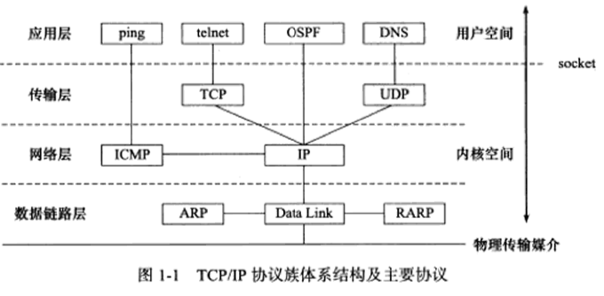

### 1.1.1 数据链路层

数据链路层两个常用的协议是ARP协议和RARP协议（地址解析协议和逆地址解析协议），实现IP地址和机器物理地址之间的相互转换。

ARP协议的用途：网络层使用IP地址寻址一台机器，而数据链路层使用武力地址寻址一台机器，因此网络层就必须先将目标机器的IP地址转化成其物理地址，才能使用数据链路层提供的服务。

### 1.1.2 网络层

网络层实现数据包的路由和转发。通信的两台主机一般不是直接相连的，而是通过多个中间节点（路由器）连接的。**网络层的任务就是选择这些中间节点，以确定两台主机之间的通信。**

​		网络层最核心的协议是IP协议(Interet Protocol，因特网协议）。IP协议根据数据包的
目的IP地址来决定如何投递它。如果数据包不能直接发送给目标主机，那么加协议就为它
寻找一个合适的下一跳(next hop）路由器，并将数据包交付给该路由器来转发。多次重复
这一过程，数据包最终到达目标主机，或者由于发送失败而被丢弃。可见，IP协议使用逐跳
(hop by hop）的方式确定通信路径。

### 1.1.3 传输层

传输层只关心通信的起始端和目的端，而不在乎数据包的中转过程。

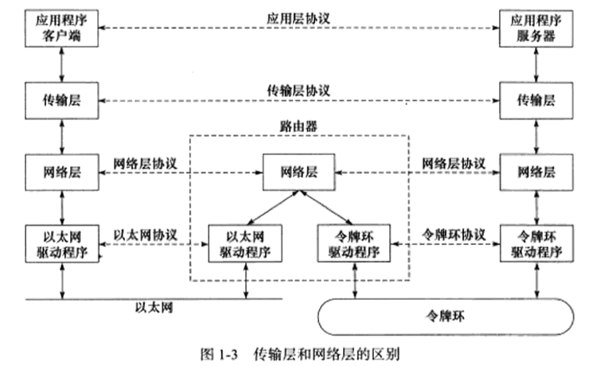

传输层的协议主要有三个：TCP、UDP、SCTP

### 1.1.4 应用层

常见的协议：

- ping 是应用程序，而不是协议，前面说过它利用ICMP 报文检测网络途接，是调试网络环境的必备工具。
- tclnet 协议是一种远程登录协议，它使我们能在本地完成远程任务
- OSPF (Open Shortest Path First，开放最短路径优先）协议是一种动态路由更新协议，用于路由器之间的通信，以告知对方各自的路由信息。
- DNS （Domain Name Service，域名服务）协议提供机器域名到IP地址的转换

### 1.2 封装

应用程序数据程序在发送到物理网络之前，将沿着协议栈从上到下依次传递。每层协议都在上层数据的基础上加上自己的头部信息，来实现该层的功能。

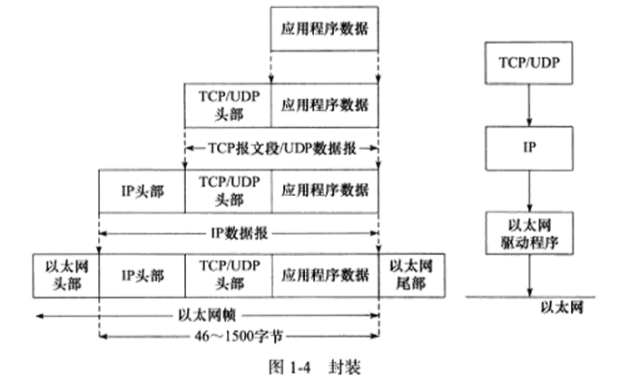

## 1.3 分用

当帧到达目的主机时，将沿着协议栈自底向上依次传递。各层协议依次处理帧中本层负责的头部数据，以获取所需的信息

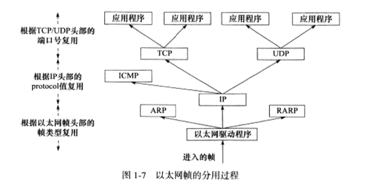

## 1.5 ARP协议工作原理

Address Resolve Protocol，地址解析协议

ARP能实现任意网络层地址到任意物理层地址的转换，此处仅讨论从IP到MAC的转换

工作原理：主机向自己所在的网络广播一个ARP请求，该请求包含目标机器的网络地址。此网络上的其他机器都将收到这个请求，但只有被请求的目标机器会回应一个ARP应答，其中包含自己的物理地址。

[计网重点](https://www.nowcoder.com/discuss/870064?type=all&order=recall&pos=&page=0&ncTraceId=&channel=-1&source_id=search_all_nctrack&gio_id=7E8B3EE5C5E7EBB31656A29C304C17C6-1649152398289)

### 1.5.1 报文详解

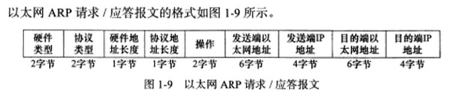

- 硬件类型字段定义物理地址的类型， 1 表示 MAC 地址
- 协议类型字段表示要映射的协议地址类型， 0x800， 表示IP地址
- 硬件地址长度和协议地址长度字段，单位是字节，MAC地址是6，IPv4是4
- 操作字段有4种类型：ARP请求（1），ARP应答（2），RARP请求（3），RARP应答（4）
- 最后4个字段指定通信双方的以太网络和IP地址。**发送端**填充除目的端以太网地址外的其他3个字段，以构建ARP请求并发送。**接收端**发现该请求的目的端IP地址是自己，就把自己的以太网地址填进去，然后交换两个目的端地址和两个发送端地址，以构建ARP应答并返回（将操作字段设置为2ARP应答）

### 1.5.2 ARP高速缓存的查看和修改

ARP维护一个高速缓存，其中包含经常访问或最近访问的机器IP到MAC的映射，避免重复请求，提高发送速度。

``` shell
// Linux下
arp -a //查看ARP缓存
sudo arp -d 192.168.1.122  // 删除对应的ARP
sudo arp -s IP MAC   // 添加ARP缓存 
```

## 1.6 DNS工作原理

我们通常是通过域名来访问网站而不是IP地址，就需要域名查询服务。将域名转换为IP地址

### 1.6.1 DNS查询和应答报文详解

DNS是一套分布式的域名服务系统。每个DNS服务器上都存放着大量的机器名都IP地址的映射，并且是动态更新的。

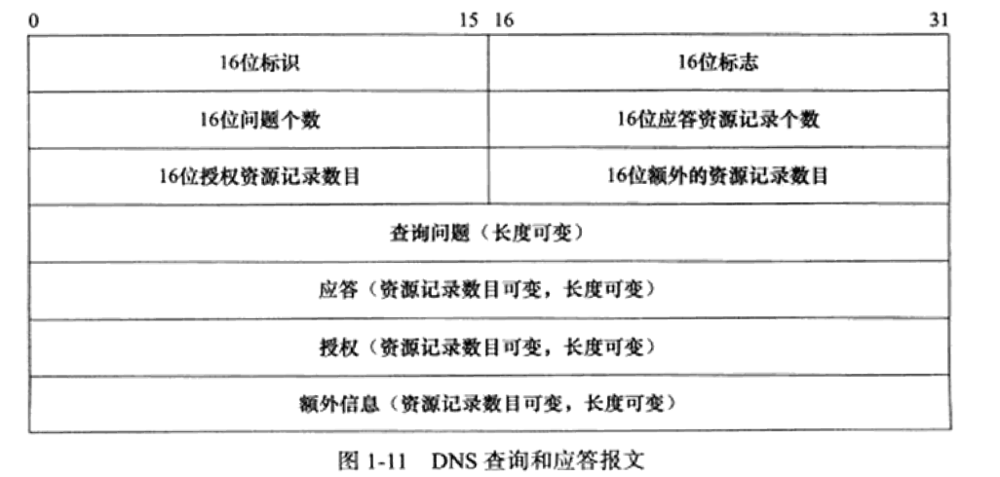

16位标识字段用于标记一对DNS查询和应答，以此区分一个DNS应答是哪个DNS查询的回应。

16位标志字段用于协商具体的通信方式和反馈通信状态。

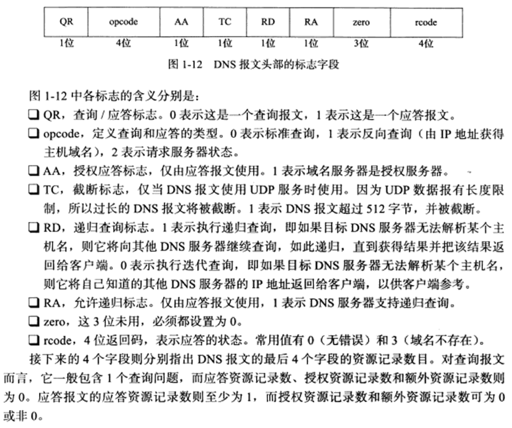

查询问题的格式如下：


- 类型A，值是1，表示获取目标主机的IP地址
- 类型CNAME，值是5，表示获得目标主机的别名
- 类型PTR，值是12，表示反向查询

16位查询类通常为1表示获取因特网的地址

### 1.6.2 Linux下访问DNS服务

```
host -t A www.baidu.com
```


获取别名和对应的两个ip地址

### 1.6.3 socket和TCP/IP协议族的关系

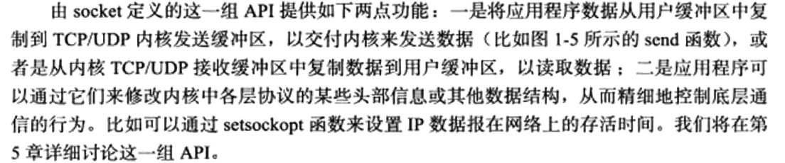

# 2. IP协议详解

本章从两个方面探讨IP协议：

- IP头部信息。IP头部信息出现在每个IP数据报中，用于指定IP通信的源端IP地址、目的端IP地址，指导IP分片和分组，以及指定部分通信行为。
- IP数据报的路由和转发。IP数据报的路由和转发发生在除目标机器之外的所有主机和路由器上。他们决定数据报是否应该转发以及如何转发。

## 2.1 IP服务的特点

IP协议是TCIP/IP协议族的动力，它为上层协议提供无状态、无连接、不可靠的服务。

IP协议是 TCP/IP 协议族的动力，它为上层协议提供无状态、无连接、不可靠的服务。

无状态（stateless）是指 IP通信双方不同步传输数据的状态信息，因此所有IP数据报的发送、传输和接收都是相互独立、没布上下文关系的。这种服务最大的缺点是无法处理乱序和重复的IP数据报。比如发送端发送出的第 N个IP数据报可能比第 N+1 个IP数据报后到达接收端，而同一个1数据报也可能经过不同的路径多次到达接收端。在这两种情况下，接收端的 IP模块无法检测到乱序和重复，因为这些IP数据报之间没有任何上下文关系。接收端的IP模块只要收到了完整的IP数据报（如果是IP 分片的话，IP模块将先执行重组），就将其数据部分 《TCP 报文段、UDP 数据报或者 ICMP 报文）上交给上层协议。那么从上层协议来看，这此数据就可能是乱序的、重复的。面向连接的协议，比如TCP 协议，则能够自己处理乱序的、重复的报文段，它递交给上层协议的内容绝对是有序的、正确的。
	虽然IP数据报头部提供了一个标识字段（见后文）用以唯一标识一个IP数据报，但它是被用来处理 IP 分片和重组的，而不是用来指示接收顺序的。
	无状态服务的优点也很明显：简单、高效。我们无须为保持通信的状态而分配一些内核资源，也无须每次传输数据时都捞带状态信息。在网络协议中，无状态是很常见的，比如UDP 协议和 HTTP 协议都是无状态协议。以HTTP 协议为例，一个浏览器的连续两次网页请求之间没有任何关联，它们将被Web 服务器独立地处理，无连接 (connectionless）是指IP 通信双方都不长久地维持对方的任何信息。这样，层协议每次发送数据的时候，都必须明确指定对方的IP地址。

  不靠谱是指IP协议不能保证IP数据报准确地到达接收端，只是尽力而为

## 2.2 IPv4头部结构

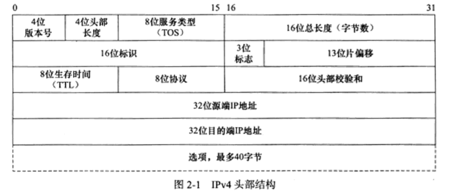

## 2.3 分片

IP数据报的长度超过帧的MTU时，它被分片传输。分片可能发生在发送端，也可能发生在中转路由器上，也有可能在传输过程中被多次分片，只有在最终的目标机器上，被内核的IP模块重新组装。

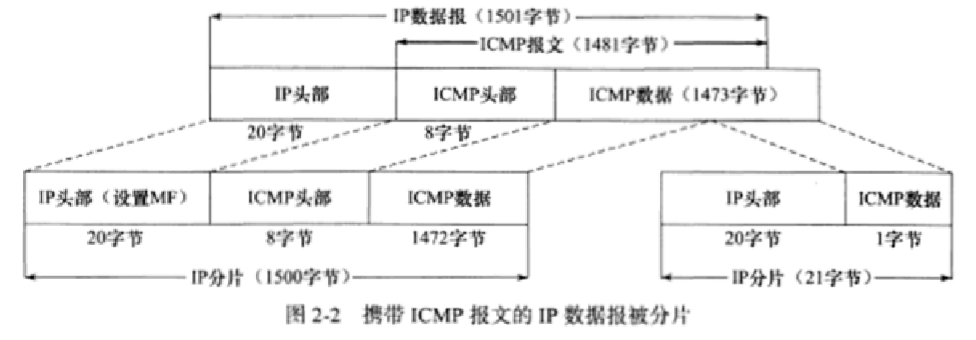

## 2.4 IP路由

IP协议的一个核心任务是数据报的路由，即决定发送数据报到目标机器的路径。

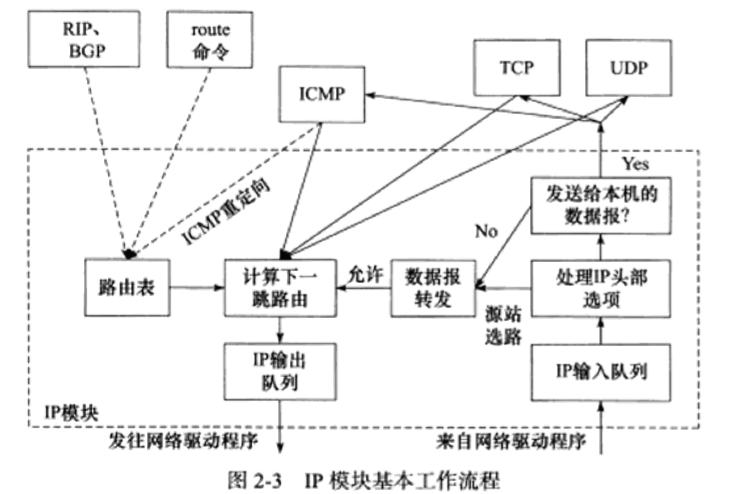

### 关于ICMP

Internet 控制消息协议 (ICMP) 是网络设备用来诊断网络通信问题的[网络层协议。](https://www.cloudflare.com/learning/network-layer/what-is-the-network-layer/)ICMP 主要用于确定数据是否及时到达其预期目的地。通常，ICMP[协议](https://www.cloudflare.com/learning/network-layer/what-is-a-protocol/)用于网络设备，例如路由器。ICMP 对于错误报告和测试至关重要，但它也可用于[分布式拒绝服务 (DDoS) 攻击](https://www.cloudflare.com/learning/ddos/what-is-a-ddos-attack/)。

ICMP 的主要目的是报告错误。当两个设备通过 Internet 连接时，ICMP 会生成错误以与发送设备共享，以防任何数据未到达其预期目的地。例如，如果[数据包](https://www.cloudflare.com/learning/network-layer/what-is-a-packet/)对于路由器来说太大，路由器将丢弃该数据包并将 ICMP 消息发送回数据的原始源。

ICMP 协议的第二个用途是执行网络诊断；常用的终端实用程序 traceroute 和 ping 都使用 ICMP 进行操作。traceroute 实用程序用于显示两个 Internet 设备之间的[路由路径。](https://www.cloudflare.com/learning/network-layer/what-is-routing/)路由路径是请求在到达其目的地之前必须经过的已连接路由器的实际物理路径。一个路由器和另一个路由器之间的旅程称为“跳”，并且跟踪路由还报告沿途每一跳所需的时间。这对于确定网络延迟的来源很有用。

### IP的路由机制

分为3个步骤：

1. 查找路由表中和数据报的目标IP地址完全匹配的主机IP地址。如果找到就使用该路由项，没找到跳到步骤2
2. 查找路由表中和数据报的目标IP地址具有相同网路的ID的网络IP地址，没找到则跳转到步骤3
3. 选择默认路由器，这通常意味着数据报的下一跳路由是网关

## 2.5 IP转发

对于允许IP数据报转发的系统（主机或路由器），数据报转发子模块将对期望转发的数据报执行如下操作：

1. 检查数据报头部的TTL值，如果TTL值已经是0，则丢弃该数据报。
2. 查看数据报头部的严格源路由选择选项。如果该选项被设置，则监测数据报的目标IP地址是否是本机的某个IP地址。如果不是，则发送一个ICMP源站选择路由失败报文给发送端。
3. 如果有必要，则给源端发送一个ICMP重定向报文，以告诉它下一个更合理的下一跳路由器
4. 将TTL减1
5. 处理IP头部选项
6. 如果有必要，则执行IP分片操作

## 2.6 重定向

## 2.7 IPv6

# 3. TCP协议详解

和IP协议相比，TCp更靠近应用层，因此具有更强的可操作性。一些重要的socket选项都和TCP协议相关

从四方面讨论TCP协议

- TCP头部信息。TCP头部信息出现在每个TCP报文段中，用于指定通信的源端端口号、目的端口号，管理TCP连接，控制两个方向的数据流。
- TCP状态转移过程。TCP连接的任意一端都是一个状态机。在TCP连接从建立到断开的整个过程中，连续两端的状态机将经历不同的状态变迁。
- TCP数据流。通过分析TCP数据流。
- TCP数据流的控制。为了保证可靠传输和提高网络通信质量

## 3.1 TCP服务的特点

传输层主要的协议有两个：TCP协议和UDP协议。TCP协议相对于UDP协议的特点是：面向连接、字节流和可靠传输。

使用TCP协议通信的双方必须先建立连接，然后才开始数据的读写。双方都必须为该连接分配必要的内核资源，以管理连接的状态和连接上数据的传输。TCP连接是全双工的。

TCP是一对一的

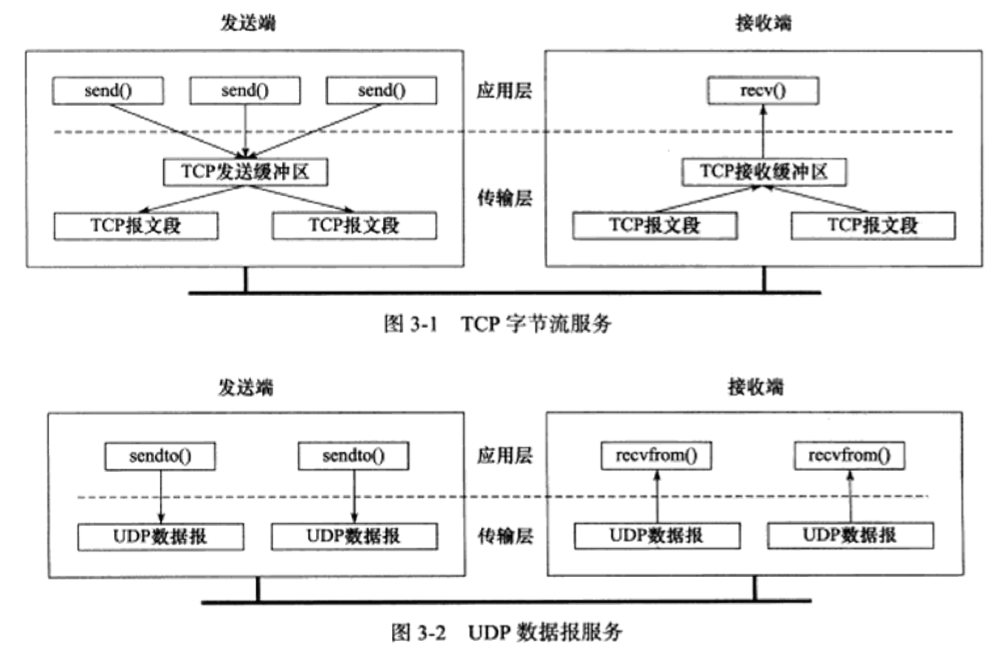


TCP传输是可靠的。TCP协议采用发送应答机制，超时重传机制，对乱序、重复进行重排、整理。

## 3.2 TCP头部


# 4. TCP/IP通信案例：访问Internet上的Web服务器

